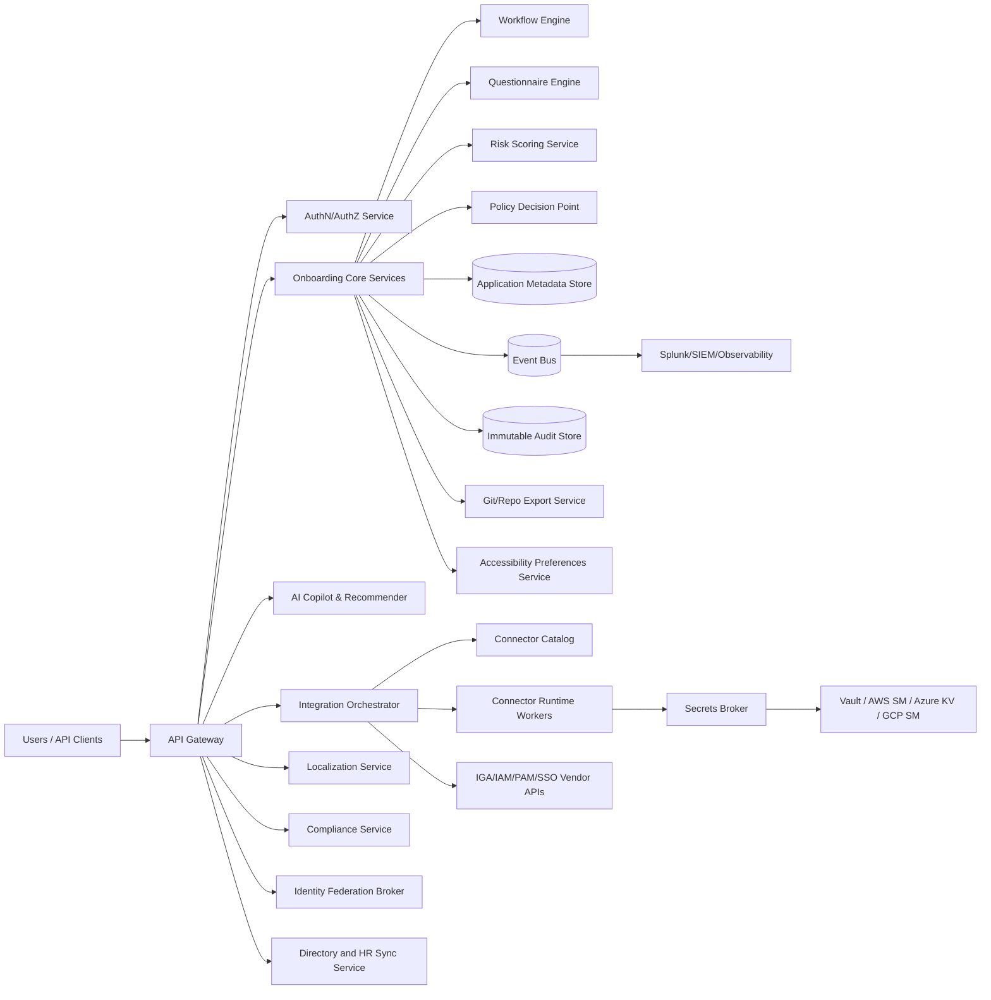

# 02. Reference Architecture

## High-Level Architecture

---

## Deployment Model (True Multi-Cloud SaaS)

### Control Plane (Global)
- Tenant management
- Policy templates
- Connector catalog metadata
- AI model orchestration control

### Data Plane (Regional)
- Tenant onboarding data
- Workflow runtime
- Connector job execution
- Regional data residency enforcement

### Isolation Tiers
- **Shared SaaS**: Logical tenant isolation with strict row-level and key-level controls
- **Dedicated Tenant**: Optional isolated data plane/VPC for high-regulation tenants

---

## Core Service Domains

1. **Tenant & Access Domain**
   - Tenant lifecycle, SSO, SCIM, role and permission management

2. **Application Registry Domain**
   - Source-of-truth for apps, environments, schemas, control mappings

3. **Questionnaire Domain**
   - Template authoring, dynamic rules, assignments, responses, evidence

4. **Workflow Domain**
   - Approval, escalation, delegation, SLA timers, audit state transitions

5. **Integration Domain**
   - Connector strategy, execution orchestration, retries, failure handling

6. **Secrets Domain**
   - Secret path registration, brokered retrieval, rotation policy hooks

7. **Audit/Observability Domain**
   - Immutable event trail, SIEM forwarding, runbook alerts

8. **AI Domain**
   - Recommendation, copilot, extraction, risk scoring, explainability logs

9. **Localization Domain**
   - Translation catalogs, locale fallback rules, locale-aware rendering contracts

10. **Compliance Domain**
   - Control library, policy mapping, evidence collection, compliance reporting

11. **Identity Federation Domain**
   - Enterprise IdP integrations, login policy routing, token trust management

12. **Source Sync Domain**
   - HR/IAM connector orchestration, user/group/app metadata ingestion, conflict resolution

---

## Canonical Data Model (Simplified)

- `Tenant`
  - id, name, region, isolationTier, consentPolicy
- `User`
  - id, tenantId, roleBindings, authProvider
- `Application`
  - id, tenantId, name, owner, businessCriticality, dataClassification
- `ApplicationEnvironment`
  - id, applicationId, envName, endpoint, authType, schemaRef
- `ApplicationInstance`
  - id, applicationId, instanceName, environmentType, endpoint, connectorProfileId, secretRef
- `QuestionnaireTemplate`
  - id, version, sectionRules, scoringRules
- `QuestionnaireInstance`
  - id, applicationId, assignments, state, dueDate
- `WorkflowTemplate`
  - id, version, nodes, transitions, escalationRules
- `WorkflowRun`
  - id, subjectType, subjectId, stage, status, approvals
- `ConnectorDefinition`
  - id, vendor, product, type (OOTB/custom/webservice), capabilities
- `ConnectorExecution`
  - id, connectorId, runStatus, requestHash, responseHash
- `SecretReference`
  - id, provider, path, rotationPolicy, scope
- `AuditEvent`
  - id, actor, action, resource, timestamp, signature
- `LocalizationBundle`
  - id, namespace, locale, version, status
- `AccessibilityPreference`
  - id, userId, keyboardMode, reducedMotion, contrastMode
- `ComplianceControl`
  - id, framework, controlId, statement, evidenceRules, owner
- `AuthProviderConfig`
  - id, tenantId, providerType, protocol, status, priority
- `SyncConnectorConfig`
  - id, tenantId, sourceType, provider, mode, filterPolicy, status
- `SyncJob`
  - id, connectorId, runType, startedAt, completedAt, status, stats

---

## Connector Decision Framework

1. Identify target vendor + product + version.
2. Query Connector Catalog:
   - Exact OOTB connector available? -> use OOTB.
   - Compatible OOTB with minor adaptations? -> use mapped template.
3. No OOTB:
   - Generate custom connector scaffold from app schema.
   - Validate required CRUD + entitlement/reconciliation operations.
4. If custom not feasible in required scope:
   - Generate web services style integration profile.
5. Persist chosen strategy and rationale in audit trail.

---

## Security Architecture

- OIDC/SAML SSO with optional MFA policy hooks
- Fine-grained authorization via policy engine (RBAC + ABAC)
- Tenant-scoped encryption keys (KMS/HSM backed)
- PII and sensitive field tokenization
- Signed API requests for system-to-system integrations
- End-to-end audit immutability with integrity checks
- Data minimization and purpose-limitation enforcement
- Privacy-by-design controls for regulated data classes
- Token validation and audience enforcement for federated identities
- Per-tenant IdP trust store and certificate rotation workflow

---

## Identity Federation Architecture

- Identity federation broker supports OIDC/SAML/OAuth2-based inbound authentication.
- Tenant-specific auth policy can route users to configured enterprise IdP.
- Optional fallback IdP for continuity during provider outage.
- SCIM integration supports identity lifecycle synchronization and deprovisioning.
- Group and claim mapping pipeline maps external attributes to internal RBAC/ABAC controls.

---

## HR and IAM Source Sync Architecture

- Connector framework supports HR and IAM source systems as inbound authoritative feeds.
- Sync modes:
  - scheduled batch,
  - event-driven,
  - delta incremental,
  - full reconciliation.
- Ingestion pipeline performs normalization into canonical user and application metadata schemas.
- Conflict resolver applies source precedence and timestamp-aware merge policy.
- Sync changes are emitted as auditable domain events with rollback checkpoints.

---

## Accessibility and Keyboard-Only Architecture

- All actionable UI components must be reachable and operable via keyboard.
- Focus management service enforces deterministic tab order and focus restoration.
- Command palette + keyboard shortcut registry for primary workflows.
- Accessibility preferences are persisted per user and applied cross-session.
- Automated accessibility tests integrated in CI (axe + keyboard path checks).

---

## Localization and Internationalization Architecture

- Central localization service provides versioned translation bundles.
- Locale negotiation order:
  1) explicit user preference,
  2) tenant default locale,
  3) browser `Accept-Language`,
  4) system fallback (`en-US`).
- Support ICU message format for plurals, gender, and interpolation.
- Localize UI labels, questionnaire content, notifications, and API error messages.
- Store canonical business values independent of locale to avoid data drift.

---

## Secrets Integration Pattern

- Store only secret metadata pointers (`secret://provider/path`) in platform records.
- Use short-lived broker tokens for retrieval at runtime.
- Allow vendor products to consume external secret references when supported.
- Provide secret reference fallback mapping where vendor lacks native support.

---

## Observability and SIEM

- Logs: JSON structured logs with correlation IDs
- Metrics: service, workflow, connector, SLA metrics
- Traces: distributed traces across API, workflow, connector execution
- Destinations: Splunk HEC, Elastic, Sentinel, Datadog (adapter model)
- Compliance telemetry: control status changes, evidence generation, policy exceptions

---

## Compliance-by-Design Architecture

- Unified control framework mapped to SOC1/SOC2, GDPR, HIPAA, SOX, PCI DSS, CCPA/CPRA, ISO 27001/27701/22301.
- Policy-as-code enforcement for access, retention, encryption, and segregation of duties.
- Evidence service collects immutable proof artifacts for each control objective.
- Audit-ready reporting endpoints generate framework-specific compliance packs.
- Continuous control monitoring pipeline detects drift and opens remediation workflows.

---

## Data Portability and Migration

- Export complete config packages:
  - applications
  - schemas
  - questionnaires
  - workflow templates
  - connector mappings
  - non-sensitive runtime metadata
- Sign and version packages in Git/repo
- Rehydrate into new target vendor integration with minimal remapping
