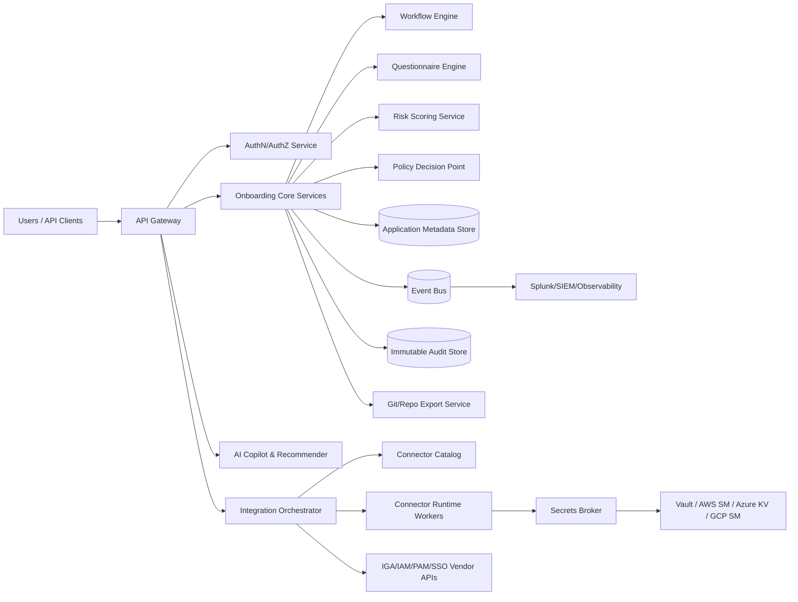

# 02. Reference Architecture

## High-Level Architecture

---

## Deployment Model (True Multi-Cloud SaaS)

### Control Plane (Global)
- Tenant management
- Policy templates
- Connector catalog metadata
- AI model orchestration control

### Data Plane (Regional)
- Tenant onboarding data
- Workflow runtime
- Connector job execution
- Regional data residency enforcement

### Isolation Tiers
- **Shared SaaS**: Logical tenant isolation with strict row-level and key-level controls
- **Dedicated Tenant**: Optional isolated data plane/VPC for high-regulation tenants

---

## Core Service Domains

1. **Tenant & Access Domain**
   - Tenant lifecycle, SSO, SCIM, role and permission management

2. **Application Registry Domain**
   - Source-of-truth for apps, environments, schemas, control mappings

3. **Questionnaire Domain**
   - Template authoring, dynamic rules, assignments, responses, evidence

4. **Workflow Domain**
   - Approval, escalation, delegation, SLA timers, audit state transitions

5. **Integration Domain**
   - Connector strategy, execution orchestration, retries, failure handling

6. **Secrets Domain**
   - Secret path registration, brokered retrieval, rotation policy hooks

7. **Audit/Observability Domain**
   - Immutable event trail, SIEM forwarding, runbook alerts

8. **AI Domain**
   - Recommendation, copilot, extraction, risk scoring, explainability logs

---

## Canonical Data Model (Simplified)

- `Tenant`
  - id, name, region, isolationTier, consentPolicy
- `User`
  - id, tenantId, roleBindings, authProvider
- `Application`
  - id, tenantId, name, owner, businessCriticality, dataClassification
- `ApplicationEnvironment`
  - id, applicationId, envName, endpoint, authType, schemaRef
- `QuestionnaireTemplate`
  - id, version, sectionRules, scoringRules
- `QuestionnaireInstance`
  - id, applicationId, assignments, state, dueDate
- `WorkflowTemplate`
  - id, version, nodes, transitions, escalationRules
- `WorkflowRun`
  - id, subjectType, subjectId, stage, status, approvals
- `ConnectorDefinition`
  - id, vendor, product, type (OOTB/custom/webservice), capabilities
- `ConnectorExecution`
  - id, connectorId, runStatus, requestHash, responseHash
- `SecretReference`
  - id, provider, path, rotationPolicy, scope
- `AuditEvent`
  - id, actor, action, resource, timestamp, signature

---

## Connector Decision Framework

1. Identify target vendor + product + version.
2. Query Connector Catalog:
   - Exact OOTB connector available? -> use OOTB.
   - Compatible OOTB with minor adaptations? -> use mapped template.
3. No OOTB:
   - Generate custom connector scaffold from app schema.
   - Validate required CRUD + entitlement/reconciliation operations.
4. If custom not feasible in required scope:
   - Generate web services style integration profile.
5. Persist chosen strategy and rationale in audit trail.

---

## Security Architecture

- OIDC/SAML SSO with optional MFA policy hooks
- Fine-grained authorization via policy engine (RBAC + ABAC)
- Tenant-scoped encryption keys (KMS/HSM backed)
- PII and sensitive field tokenization
- Signed API requests for system-to-system integrations
- End-to-end audit immutability with integrity checks

---

## Secrets Integration Pattern

- Store only secret metadata pointers (`secret://provider/path`) in platform records.
- Use short-lived broker tokens for retrieval at runtime.
- Allow vendor products to consume external secret references when supported.
- Provide secret reference fallback mapping where vendor lacks native support.

---

## Observability and SIEM

- Logs: JSON structured logs with correlation IDs
- Metrics: service, workflow, connector, SLA metrics
- Traces: distributed traces across API, workflow, connector execution
- Destinations: Splunk HEC, Elastic, Sentinel, Datadog (adapter model)

---

## Data Portability and Migration

- Export complete config packages:
  - applications
  - schemas
  - questionnaires
  - workflow templates
  - connector mappings
  - non-sensitive runtime metadata
- Sign and version packages in Git/repo
- Rehydrate into new target vendor integration with minimal remapping
